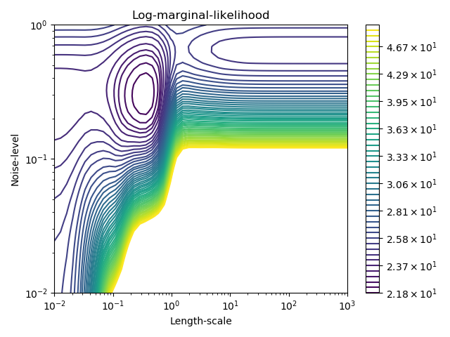

# HPSC Lab 12
2019-11-15

Click to [make your own repo](TO DO).

The goals for this lab are:
* Learn about Dask
* Fit a Gaussian process model using sklearn
* Run sklearn cross-validated hyperparameter grid search on Dask

-----

## Dask

[Dask](https://docs.dask.org/en/latest/) is a lightweight python library for flexible parallel computing.  At its core, Dask automates dynamic distribution of data and processing.  *Dynamic* means concepts such as:
* as additional Dask clients connect to the server, new processing request can automatically use those clients;
* when issuing a processing request, data is automatically parceled and moved

Whenever anything is automated it will likely not be as efficient as gritter custom-tuning.  However, Dask offers fast cluster expansion with minimal development overhead.

It filled a gap between these categories:
* embarassingly parallel (e.g. `multiprocessing`): doesn't scale past local, no collaboration
* big data collections (e.g., MapReduce, SQL): pre-defined operation paradigms, heavyweight
* task schedulers (e.g. Celery, Make): not designed for user-interaction or heavy computation

`dask.delayed` targets generic task graph creation for the Dask scheduler to execute in parallel (where possible).  For example:
```
# instead of executing in sequence:
x = func_a_to_x(a)
y = func_a_to_y(a)
z = func_combine(x,y)

# Dask can detect that x and y can be executed in parallel:
x = dask.delayed(func_a_to_x)(a)
y = dask.delayed(func_a_to_y)(a)
z = dask.delayed(func_combine)(x,y)
z.compute()
```

Dask additionally targets a handful of interfaces:
* Arrays (e.g. parallel NumPy)
* Bags (e.g. parallel lists)
* DataFrames (e.g. parallel Pandas)
* Machine Learning (e.g. parallel Scikit-Learn)
* Support for other external projects

Spend 5-10 minutes with simple demos of each of these at their [Try Online](https://mybinder.org/v2/gh/dask/dask-examples/master?urlpath=lab) link.  Of course, the downside of using this free Binder lab is that it only presents a single small node.

-----

## Gaussian process regression

Wednesday's lecture discussed Gaussian process (GP) regression, a machine learning tool of interest.  To briefly review, GP models use a covariance matrix (or, equivalently, kernel) to assess the probability of a set of observations given kernel parameters, assuming Gaussian noise in the observation output.

The standard radial-basis kernel---parameterized only by a length scale per input dimension---can be thought of as a smoothness assumption on the function being fit ("Within what distance do I expect values to be correlated?").  Additional assumptions about the problem (such as periodicity) can be encoded with alternative kernels.

`GPreg.py` gives a demo of fitting a Gaussian process using `sklearn`.  For ease of visualization, the data is a single dimension.  This example does try to illustrate how robust GP models can be even when their assumptions are wrong (in this case stationary of noise).

The [Gaussian Processes](https://scikit-learn.org/stable/modules/gaussian_process.html) page from gives a nifty example which highlights the potential non-concavity of a GP parameter space.



For this reason (and to give Dask a more interesting task-graph), `GPreg.py` fits 76 GP models via `GridSearchCV`: 15 initial GP parameters, each with 5-fold cross-validation (average probability score over each of 5 equal subsets of the observations after fitting to the other 4 subsets), plus the final.

-----

## GP regression using Dask

Copy the `GPreg.py` code into the Dask Binder (after starting the clients)

Try swapping the following:

```
estimator.fit(Xr, yr)
```

with

```
import joblib
with joblib.parallel_backend('dask'):
    estimator.fit(Xr, yr)
```

You should be able to observer the Dask task stream monitor scheduling across 4 threads.  You probably won't notice any difference in time, because joblib (used by sklearn) will schedule across processors on the local node by default.  But if you had a cluster to run on, you wouldn't need to change any other code (just set up the clients across the cluster)!